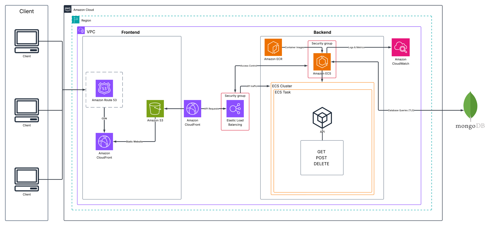

# 🎨 Mini Gallery – Cloud Computing Project

## 👨‍💻 ผู้จัดทำ
- นายสิทธิกร ชิรงค์ สาขา CAI รหัสนักศึกษา 6652300184
- นายสวรุจ สองเมือง สาขา CAI รหัสนักศึกษา 6652300338
- นางสาวชัญญพัชร์ สมบูรณ์สินชัย สาขา CAI รหัสนักศึกษา 6652300079
- นายปรุฬห์ แสนสุขบุญ สาขา CAI รหัสนักศึกษา 6652300427
- นายภาณุพงษ์ ศุภศร สาขา CAI รหัสนักศึกษา 6652300451

วิชา: Cloud Computing 

---

## 🚀 Tech Stack
- **Frontend**: HTML,CSS,Javascript (Build → Deploy to S3 + CloudFront)  
- **Backend**: Node.js API รันบน Amazon ECS (Fargate)  
- **Database**: MongoDB Atlas (TLS connection)  
- **Infra**: Route 53, CloudFront, S3, ELB, ECS, ECR, CloudWatch  
- **CI/CD**: GitHub Actions  

---

## 🏗️ Architecture Overview
```text
Client → Route 53 → CloudFront
        ├── Static (S3)
        └── API (/api/* → ALB → ECS → MongoDB Atlas)
ECS ← ECR (Docker Images)
ECS → CloudWatch (Logs, Metrics)
```


---

## 🔄 Data Flow
1. **Client → Route 53** : ผู้ใช้พิมพ์โดเมน ระบบทำ DNS resolution  
2. **Route 53 → CloudFront** : ผู้ใช้ถูกส่งไปยัง CDN distribution  
3. **CloudFront → S3** : ให้บริการ static website (HTML, CSS, JS, รูปภาพ)  
4. **CloudFront → ALB** : Forward API requests เช่น `/api/*` ไปยัง Backend  
5. **ALB → ECS Tasks** : ALB กระจายโหลดไปยัง container หลายตัว  
6. **ECS ← ECR** : ECS ดึง Docker image ล่าสุดจาก ECR  
7. **ECS → CloudWatch** : ส่ง logs และ metrics เพื่อติดตามสถานะ  
8. **ECS → MongoDB Atlas** : ติดต่อฐานข้อมูลเพื่ออ่าน/เขียนข้อมูล  

---

## 🧩 ส่วนประกอบหลัก
- **Amazon Route 53** – จัดการ DNS ของโดเมนหลัก  
- **Amazon CloudFront** – Content Delivery Network สำหรับ static & dynamic content  
- **Amazon S3** – เก็บไฟล์ Static ของ frontend  
- **Elastic Load Balancer (ALB)** – กระจายโหลด API ไป ECS  
- **Amazon ECS** – รัน containerized backend (Fargate tasks)  
- **Amazon ECR** – เก็บ Docker Images  
- **Amazon CloudWatch** – เก็บ Logs และ Metrics  
- **Security Groups** – ควบคุมการเข้าถึงระหว่าง services  
- **MongoDB Atlas** – Database ภายนอก เชื่อมต่อด้วย TLS  

---

## 🔄 CI/CD Pipeline
### Frontend
1. GitHub Actions build frontend (HTML,CSS,Javascript)  
2. Upload `frontend/` ไปยัง S3 bucket  
3. Invalidate CloudFront cache  

### Backend
1. GitHub Actions build Docker image ของ API  
2. Push image ไปยัง Amazon ECR  
3. Update ECS Service ให้ deploy task ใหม่ (rolling update)  

---

## 📊 Monitoring & Scaling
- **Logs**: ECS → CloudWatch  
- **Auto Scaling**: ECS Service ปรับตาม CPU Utilization (AverageCPU > 60%)  
- **Load Test**: ใช้ k6 สำหรับจำลองผู้ใช้งานจำนวนมาก  

---

## 🔐 Security
- **Security Groups**:  
  - CloudFront → ALB (HTTPS/443)  
  - ALB → ECS (เฉพาะพอร์ต API)  
- **Secrets Management**: เก็บ MongoDB URI ใน AWS Secrets Manager  
- **TLS Everywhere**: ทุกการเชื่อมต่อเข้ารหัสด้วย TLS/HTTPS  